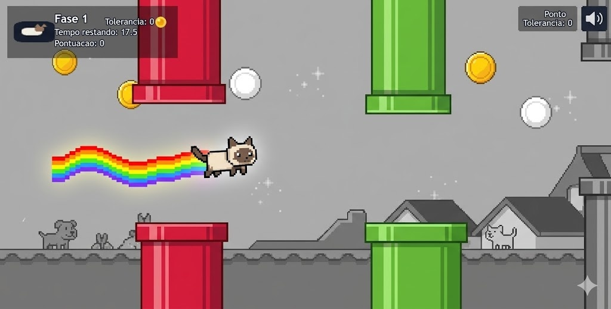

# Muda

Jogo 2D feito com Phaser 3, HTML, CSS e JavaScript puro. A versao ativa do projeto coloca a personagem em um cenario urbano que comeca mais neutro e ganha cor ao longo das fases, enquanto a dificuldade aumenta progressivamente.



## Sobre o jogo

Em `Muda`, o jogador controla a personagem principal em um desafio de sobrevivencia e reflexo. A ideia central e atravessar obstaculos, manter a pontuacao crescendo e chegar ate o final das 7 fases.

O projeto atual usa:

- `index.html` como ponto de entrada
- `game_v11_muda_final.js` como logica principal ativa
- `MudaPlayer_v2.js` como controlador visual e fisico da personagem
- `style.css` para a apresentacao da pagina

## Mecanicas principais

- O jogo comeca no menu e inicia com clique/toque, `Espaco` ou seta `Para Cima`.
- Durante a partida, os mesmos comandos fazem a personagem subir.
- O jogador precisa desviar dos obstaculos que entram pela direita da tela.
- Cada fase dura um tempo proprio e, ao ser concluida, avanca para a proxima.
- Sao 7 fases no total.
- O cenario vai ficando mais colorido ao longo da progressao.
- O jogo registra a melhor pontuacao no navegador com `localStorage`.

## Pontuacao e progresso

- Passar por um conjunto de obstaculos soma `+1` ponto.
- Coletar um power-up soma `+3` pontos.
- Concluir uma fase soma `+10` pontos.
- Ao terminar a ultima fase, o jogo leva para a tela de vitoria.
- Se as vidas chegarem a zero, o jogo vai para `Game Over`.

## Vidas, dano e power-ups

- A partida inicia com `3` vidas.
- Ao sofrer dano, o jogador perde `1` vida.
- Depois de tomar dano, existe um curto periodo de invencibilidade visual para evitar hits em sequencia.
- Cada fase tenta gerar ate `3` power-ups.
- Coletar um power-up adiciona `+1` vida e tambem aumenta a pontuacao.

## Identidade visual da versao atual

- Personagem com tratamento visual proprio em `MudaPlayer_v2.js`
- Rastro colorido estilo arco-iris
- Cenario urbano com parallax
- Evolucao visual por saturacao de cores entre as fases
- Variacoes antigas do jogo preservadas em arquivos versionados e pastas de backup

## Como executar localmente

Nao ha etapa de build. O projeto e estatico.

### Opcao 1: abrir diretamente

Abra o arquivo `index.html` no navegador.

### Opcao 2: usar servidor local

Recomendado para evitar bloqueios de assets por `file://` em alguns navegadores.

Exemplos:

Se voce usa a extensao Live Server no VS Code, basta abrir a pasta do projeto e iniciar o servidor pela extensao.

Outro exemplo:

```powershell
python -m http.server 8080
```

Depois, abra:

```text
http://localhost:8080
```

## Estrutura do projeto

```text
Muda/
|-- index.html
|-- style.css
|-- game_v11_muda_final.js
|-- MudaPlayer_v2.js
|-- gatinha_frame.png
|-- gatinha.png
|-- RetroCatsFree.png
|-- muda.jpg
|-- backups/
|-- beckups/
```

## Arquivos importantes

- `game_v11_muda_final.js`: loop principal, fases, obstaculos, HUD, menu, vitoria e game over
- `MudaPlayer_v2.js`: personagem, hitbox, invencibilidade visual e rastro
- `index.html`: carrega Phaser por CDN e ativa a versao atual do jogo
- `backups/` e `beckups/`: historico de iteracoes anteriores

## Observacoes

- O projeto referencia trilhas e efeitos sonoros locais na pasta `audio/`, mas a logica atual foi escrita para continuar funcionando mesmo quando esses arquivos nao estiverem disponiveis.
- O repositorio tambem guarda versoes anteriores do jogo para comparacao e rollback rapido.

## Tecnologias

- HTML5
- CSS3
- JavaScript
- Phaser 3.80.1

## Status

Versao ativa no momento:

- `game_v11_muda_final.js`
- `MudaPlayer_v2.js`

Se quiser evoluir o projeto, um bom proximo passo e organizar as versoes antigas, separar assets por pasta e criar uma pasta `audio/` documentada com os arquivos esperados pelo jogo.
